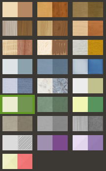
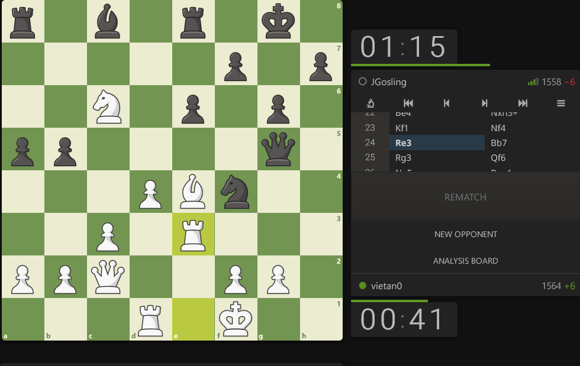

  

<h1 align="center">Chess.com Skin for Lichess</h1>

Chess.com Skin for Lichess is a browser extension that replace Lichess's board, pieces & sound effects with Chess.com's.

  <a href="https://addons.mozilla.org/en-US/firefox/addon/chesscom-skin-for-lichess/">
    <picture>
      <source srcset="https://i.imgur.com/ZluoP7T.png" media="(prefers-color-scheme: dark)">
      
    </picture>
  </a>
  <a href="https://chromewebstore.google.com/detail/chesscom-skin-for-lichess/ilfjmdbmifhbemnnoifhmafocdibbkmm">
    <picture>
      <source srcset="https://i.imgur.com/hcbQhpp.png" media="(prefers-color-scheme: dark)">
      
    </picture>
  </a>
  <a href="https://microsoftedge.microsoft.com/addons/detail/hiipidmcjpncdnfielfigiggfkokilmk">
    <picture>
      <source srcset="https://i.imghippo.com/files/kzlh4501Ex.png" media="(prefers-color-scheme: dark)">
      
    </picture>
  </a>

  
  
  

> 🚧 **Must select Green board in Lichess settings first.**
>
> 

## Screenshots

